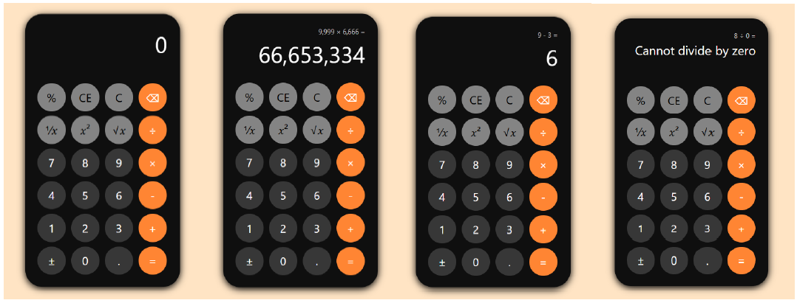

# Calculator Project

## Overview

This project is a fully functional calculator application designed to perform a variety of mathematical operations, including basic arithmetic, unary operations, and advanced error handling. The calculator is inspired by the standard Microsoft Calculator interface, providing a user-friendly experience with clear displays and intuitive controls.

## Features

### 1. **Display Screen**
   - **Description:** The main screen where numbers, calculations, and results are displayed.
   - **Usage:** Shows the current input and any ongoing calculations. When an operation is performed, the result is displayed here.

### 2. **Operation Buttons**
   - **Unary Operations:**
     - **Reciprocal (1/x):** Calculates the reciprocal of a number.
     - **Square (x²):** Squares the current number.
     - **Square Root (√x):** Calculates the square root of a number.
     - **Percentage (%):** Finds a percentage of the current number in relation to a previous number.
     - **Sign Toggle (±):** Toggles the sign of the current number between positive and negative.
   - **Binary Operations:**
     - **Addition (+):** Adds two numbers.
     - **Subtraction (-):** Subtracts one number from another.
     - **Multiplication (×):** Multiplies two numbers.
     - **Division (÷):** Divides one number by another.

### 3. **Number Buttons (0-9)**
   - **Description:** Buttons labeled from 0 through 9.
   - **Usage:** Used to enter numbers into calculations. Pressing these buttons will display the corresponding number on the screen.

### 4. **Backspace Button (←)**
   - **Description:** Deletes the last digit entered.
   - **Usage:** If a mistake is made while entering a number, press ← to remove the last digit.

### 5. **Comma-Separated Display for Operands**
   - **Description:** Numbers are displayed with commas as thousands separators for easier readability.
   - **Usage:** As you type numbers, the Calculator automatically formats them with commas, e.g., entering 1000000 shows as 1,000,000.

### 6. **Previous Operand and Operation Display**
   - **Description:** The Calculator shows the last operand and operation above the main display.
   - **Usage:** When performing calculations, the previous operand and the chosen operation (like +, -, ×, or ÷) are displayed above the current input. This helps keep track of multi-step calculations and provides context for the ongoing operation.

### 7. **Error Handling**
   - **Division by Zero:** The Calculator detects attempts to divide by zero and displays an error message.
   - **Overflow Error:** The Calculator handles overflow errors for extremely large numbers, with a maximum limit of 9.999999999999x10^{1000}.
   - **Square Root of Negative Number:** The Calculator displays an error when attempting to take the square root of a negative number.

## Example Usage

Let's evaluate the following expression step-by-step:

\[
(15 + 25) * 2 - (50 / 5) + \sqrt{81}
\]

1. **Start with the First Parenthesis:**
   - Enter 15, then press +, and enter 25.
   - Press = to get 40.

2. **Multiply by 2:**
   - With 40 still on the **Display Screen**, press × and then 2.
   - Press = to get 80.

3. **Subtract Division Result:**
   - Enter 50, then press ÷, and enter 5.
   - Press = to get 10.
   - Now enter 80 from the last operation and press – and enter 10.
   - Press = to get 70.

4. **Add the Square Root Calculation:**
   - With 70 as the current result on the **Display Screen**, enter 81 and press √x to get 9.
   - Press + and then 9.
   - Press = to get the final result: 79.

**Final Result:**

\[
(15 + 25) * 2 - (50 / 5) + \sqrt{81} = 79
\]

## Error Handling Examples

- **Division by Zero:** If you attempt to divide any number by zero, the Calculator will display an error message: "Cannot divide by zero."
- **Overflow Error:** If a calculation exceeds the maximum limit of 9.999999999999x10^{1000}, the Calculator will display an overflow error message.
- **Square Root of Negative Number:** If you try to take the square root of a negative number, the Calculator will display an error message: "Invalid input."
